# Svalinn AI

[](https://img.shields.io/github/v/release/lorenzomaiuri-dev/svalinn-ai)
[](https://github.com/lorenzomaiuri-dev/svalinn-ai/actions/workflows/main.yml?query=branch%3Amain)
[](https://codecov.io/gh/lorenzomaiuri-dev/svalinn-ai)
[](https://img.shields.io/github/commit-activity/m/lorenzomaiuri-dev/svalinn-ai)
[](https://img.shields.io/github/license/lorenzomaiuri-dev/svalinn-ai)

**Svalinn AI: The unbreakable shield for your AI applications.** An open-source, self-hostable security layer that detects and blocks LLM jailbreak and prompt injection attempts before they reach your primary model. Efficiently designed to run on CPU.

- **Github repository**: <https://github.com/lorenzomaiuri-dev/svalinn-ai/>
- **Documentation**: <https://lorenzomaiuri-dev.github.io/svalinn-ai/>

## 🛡️ What is Svalinn AI?

Svalinn AI is a robust pre-screening firewall for Large Language Models (LLMs). It acts as a guardrail, analyzing every user input for malicious intent, manipulation attempts, and known jailbreak patterns. By using a multi-stage analysis process with specialized, small language models, it ensures only safe and compliant requests are forwarded to your production LLM (like GPT-4, Claude, or Llama), protecting it from exploitation and reducing API costs on invalid requests.

## ✨ Key Features

-   **🛡️ Proactive Jailbreak Detection:** Identifies and blocks prompt injection and evasion attempts using a dual-channel analysis system.
-   **⚡ Low Latency:** Achieves sub-second average response times by leveraging optimized, small language models.
-   **💾 CPU-Native & Self-Hostable:** Runs entirely on a CPU-powered machine, ensuring data privacy and eliminating reliance on external APIs. No GPU required.
-   **🔍 Advanced Deobfuscation:** Neutralizes leetspeak, unusual Unicode, and other obfuscation techniques to reveal true intent.
-   **📊 Structured Logging & Analytics:** Built-in DuckDB integration for powerful logging, real-time monitoring, and attack trend analysis.
-   **🐳 Easy Deployment:** Simple setup with Docker and a clean Python API for easy integration into any stack.

## 🏗️ How It Works

Svalinn AI employs a efficient, multi-stage pipeline to analyze every request:

```mermaid
flowchart TD
    A[User Input] --> B(Input Guardian);
    subgraph B [Dual-Channel Analysis]
        B1[Raw Text Analysis]
        B2[Normalized Text Analysis]
    end
    B -- UNSAFE --> C[🛑 Request Blocked];
    B -- SAFE --> D[Honeypot LLM];
    D --> E[Generate Response];
    E --> F(Output Guardian);
    F -- VIOLATION --> C;
    F -- COMPLIANT --> G[✅ Forward to Production LLM];
```



1.  **Input Guardian:** The input is analyzed simultaneously in its raw form and a normalized form (where obfuscations are cleared).
2.  **Honeypot:** Approved requests are sent to a deliberately vulnerable "dumb" model. If jailbroken, this model will produce a clearly violating output.
3.  **Output Guardian:** The honeypot's response is checked for any policy violations.
4.  **Decision:** Only requests that pass all stages are forwarded to your main LLM. Others are blocked and logged.

## 📦 Installation

Svalinn AI requires **Python 3.12+** and uses `uv` for fast and reliable dependency management.

### 1. Install UV

If you haven't already, install `uv`:

```bash
pip install uv
```

### 2. Clone and Install

```bash
# Clone the repository
git clone https://github.com/lorenzomaiuri-dev/svalinn-ai.git
cd svalinn-ai

# Install the project and all dependencies
make install
```

This command creates a virtual environment, installs dependencies, and generates the `uv.lock` file.

### 3. Download Models

<!-- TODO: PLACEHOLDER -->
<!-- Svalinn AI relies on GGUF-quantized models. You can download the recommended models automatically:

```bash
make download-models
```

*Or manually place model files in the `models/` directory.* -->


## 🚀 Quick Start

<!-- TODO: PLACEHOLDER -->

### Running with Docker

<!-- TODO: PLACEHOLDER -->
<!-- A `Dockerfile` and `docker-compose.yml` are provided for containerized deployment.

```bash
# Build and run using Docker Compose
docker-compose up -d --build
``` -->

## 📋 Configuration

<!-- TODO: PLACEHOLDER -->

## 🤝 Contributing

Contributions are welcome! Please feel free to submit a Pull Request.

1.  Ensure you have run `make install` to set up the development environment.
2.  Run the pre-commit hooks to ensure code quality: `uv run pre-commit run -a`
3.  Commit your changes and open a PR.

## 📄 License

This project is licensed under the MIT License - see the [LICENSE](LICENSE) file for details.
