# 🏗️ System Architecture

Svalinn AI utilizes a **Defense-in-Depth** strategy designed to run efficiently on CPU hardware. The system follows a "Fail-Fast" philosophy: if a request is detected as malicious at an early stage, it is blocked immediately to save computational resources.

## High-Level Data Flow

```mermaid
graph TD
    User([User Request]) --> Norm[Text Normalizer]
    Norm --> InputG{Input Guardian}

    %% Input Guardian Logic
    InputG -- "UNSAFE" --> Block([🚫 Block & Log])
    InputG -- "SAFE" --> Honey[Honeypot Executor]

    %% Honeypot Logic
    Honey --> OutputG{Output Guardian}

    %% Output Guardian Logic
    OutputG -- "VIOLATION" --> Block
    OutputG -- "COMPLIANT" --> Forward([✅ Forward to LLM])

    style Block fill:#f9f,stroke:#333,stroke-width:2px
    style Forward fill:#9f9,stroke:#333,stroke-width:2px
    style InputG fill:#ff9,stroke:#333,stroke-width:2px
    style OutputG fill:#ff9,stroke:#333,stroke-width:2px
```

🛡️ The Three Layers
1. Input Guardian (The Gatekeeper)

    Role: Analyzes the user's raw prompt for malicious intent before it executes.

    Mechanism: Dual-Channel Analysis.

        Channel A (Raw): Analyzes the prompt exactly as received.

        Channel B (Normalized): Analyzes the text after Deobfuscation (stripping Leetspeak, invisible characters, Base64).

    Model: Phi-3.5-mini-instruct (Highly efficient, low latency).

2. Honeypot Executor (The Trap)

    Role: A deliberately vulnerable LLM execution environment.

    Mechanism: It receives the user's prompt with a weak system prompt. If the user is attempting a jailbreak (e.g., "Ignore previous instructions"), the Honeypot is statistically likely to comply and generate harmful content.

    Model: Qwen2.5-1.5B-Instruct (High compliance, lightweight).

3. Output Guardian (The Judge)

    Role: Analyzes the response generated by the Honeypot.

    Mechanism: It doesn't look for jailbreak patterns in the prompt; it looks for Policy Violations in the output (e.g., did the model actually write a bomb recipe?).

    Logic: If the Honeypot output contains harmful content, it confirms the input was a successful jailbreak attack.

🧹 Text Normalization Engine

Before any analysis, inputs pass through the AdvancedTextNormalizer. This regex and logic-based engine neutralizes common adversarial obfuscation techniques:

    Leetspeak: h4xor → haxor

    Invisible Characters: Strips Zero-width spaces and BOMs.

    Encodings: Recursively decodes Base64 injection attempts.

    Homoglyphs: Normalizes Unicode lookalikes (e.g., ℍ → H).
